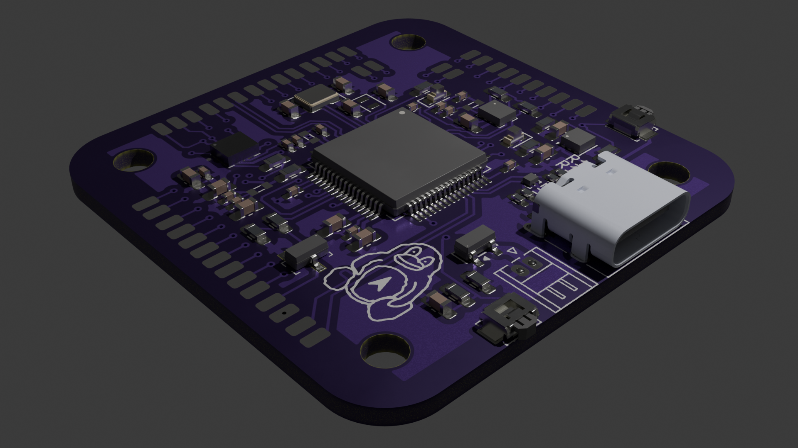
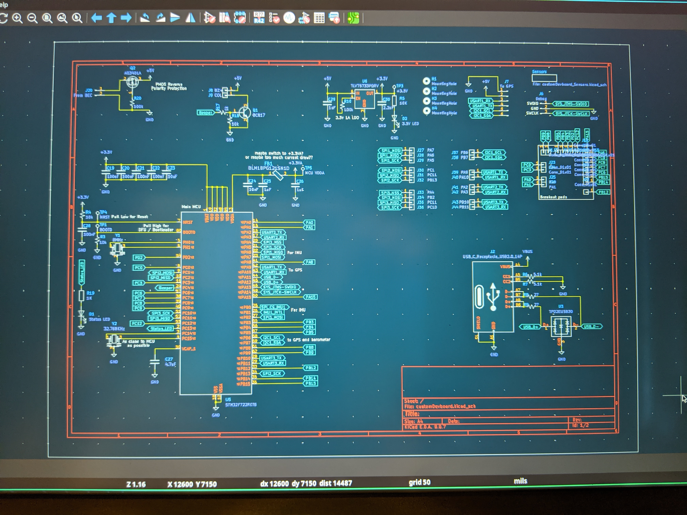
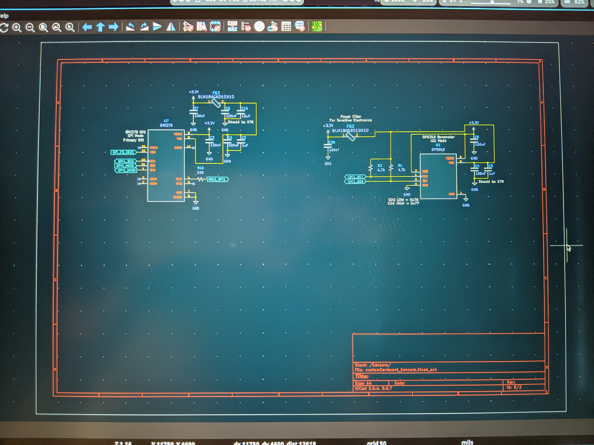
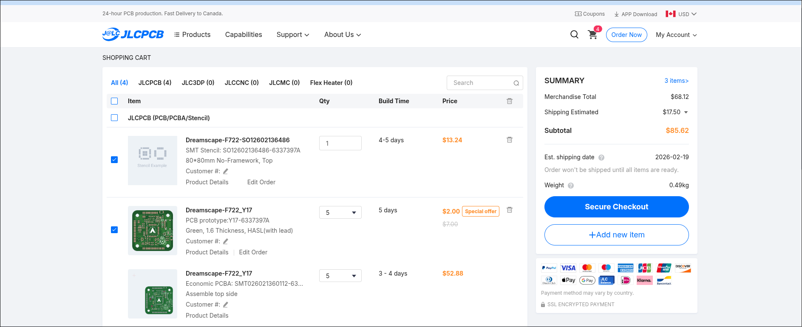
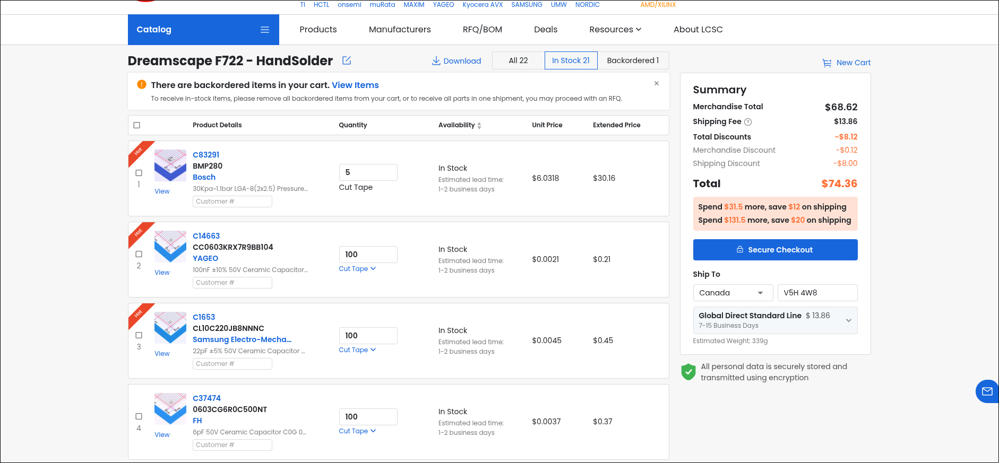
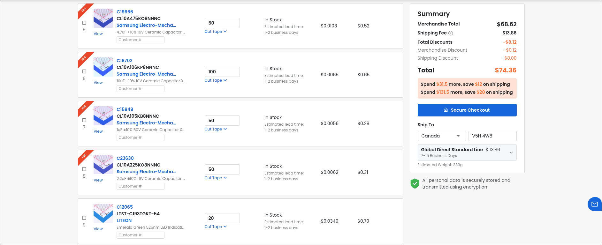
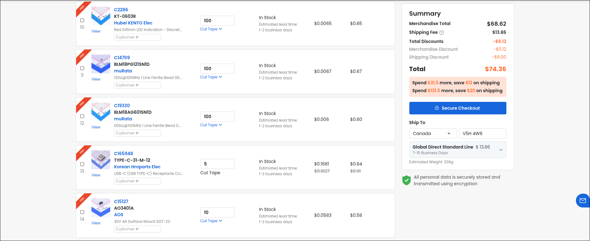
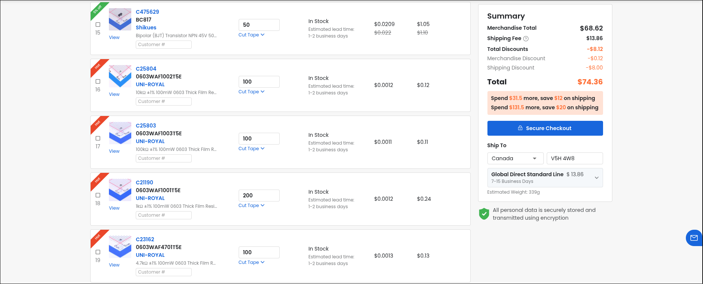
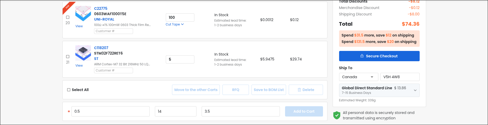

# Dreamscape F722
A Custom Flight Controller made with the STM32 F722 microcontroller in 30x30 flight controller size
- IMU: ICM-42688-P
- Barometer: BMP280
- Firmware: Betaflight

# Firmware Building
````bash
cd ~/KicadProjects/Dreamscape-F722/firmware/betaflight/betaflight
make configs
make DREAMSCAPEF722
````

# Blender Render:



# Schematics & PCB view




# prices

# LCSC (Hand Soldering)






